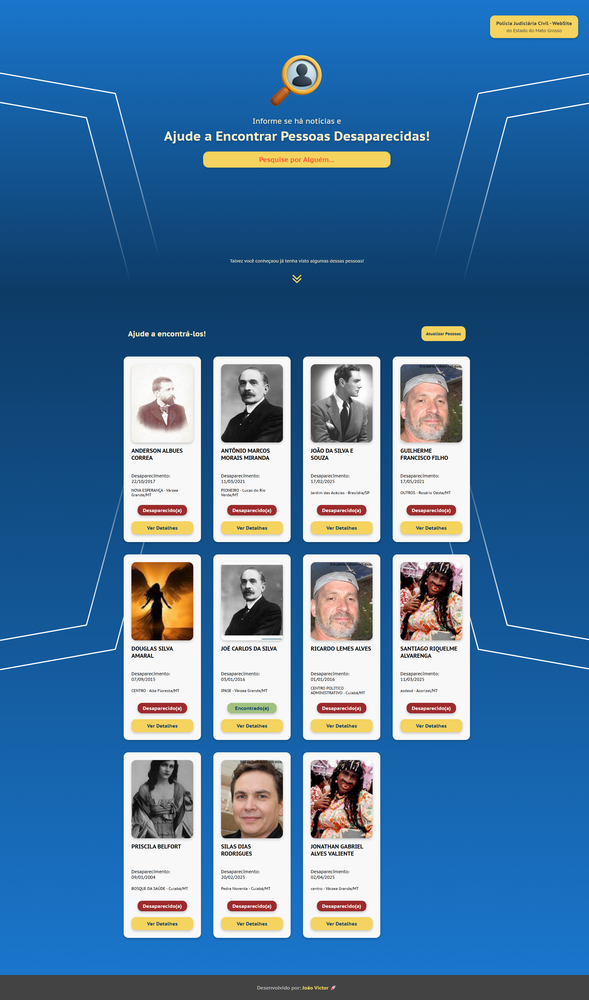
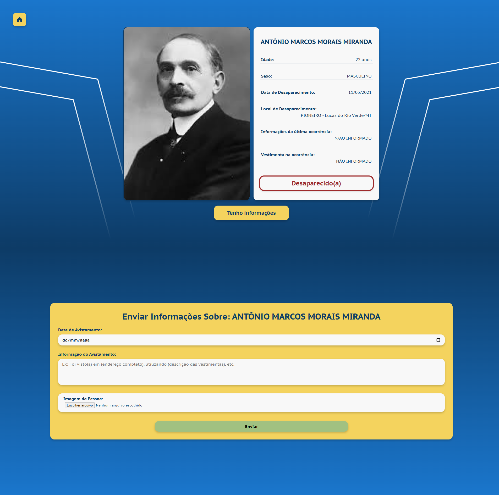

# Projeto Web para a Vaga de Desenvolvedor Junior

Site Web parar consulta de pessoas desaparecidas, e envio de informações referentes ao paradeiros delas.

## Candidato

João Victor Noschang Silva

## Plataforma de Localização de Desaparecidos

<p align="center">
  
</p>
<p align="center">
  
</p>

## 📄 Sobre o Projeto

Trata-se de uma plataforma web desenvolvida para auxiliar na busca por pessoas desaparecidas. O objetivo é fornecer uma ferramenta acessível para que a comunidade possa visualizar informações detalhadas sobre ocorrências e, de forma colaborativa, enviar dados de avistamento, como localização e fotos.

Permitindo o usuário, pesquisar pessoas, verificar uma lista de pessoas que talves ele conheça, verificar dados detalhados de uma pessoa em específico e até mesmo colaborar enviando dados de avistamento da pessoa, até mesmo enviando imagem da pessoa.

Este projeto foi construído utilizando **React** e **JavaScript** para o front-end, consumindo uma API RESTful para gerenciar as informações de pessoas desaparecidas e os dados de avistamento.

## ⚙️ Tecnologias Utilizadas

* **React:** Biblioteca JavaScript para construir interfaces de usuário.
* **React Router DOM:** Para gerenciar a navegação entre as páginas.
* **Axios:** Cliente HTTP para fazer requisições à API.
* **HTML5 & CSS3:** Para a estrutura e estilização da aplicação.
* **Docker:** Para empacotar a aplicação em um contêiner, garantindo portabilidade e consistência em diferentes ambientes.


## 🚀 Como Executar o Projeto

Siga os passos abaixo para rodar a aplicação em sua máquina local.

### Pré-requisitos

Certifique-se de que você tem o **Node.js** (versão 18+) e o **npm** ou **Yarn** instalados. Além disso, o **Docker** é necessário para rodar o projeto em um contêiner.

### 1. Clonar o Repositório

```bash
git clone [https://github.com/JoaoVictor-Noschang/projeto_buscas](https://github.com/JoaoVictor-Noschang/projeto_buscas)
cd seu-projeto
```

### 2. Instalar as Dependências

```Bash
npm install

ou

yarn install
```


### 3. Rodar a Aplicação

**Com npm**

```Bash
npm start
```

A aplicação estará disponível em http://localhost:3000.


**Com Docker**

Para rodar a aplicação em um contêiner Docker (recomendado para consistência de ambiente), siga estes passos:

Construir a imagem Docker:

```Bash
docker build -t aplicacao-buscas .
```

Executar o contêiner:

```Bash
docker run -d --name contair-app-buscas -p 3000:80 aplicacao-buscas
```

A aplicação estará disponível em http://localhost:3000.


📝 Licença
Este projeto está licenciado sob a Licença MIT.

Desenvolvido por João Victor.